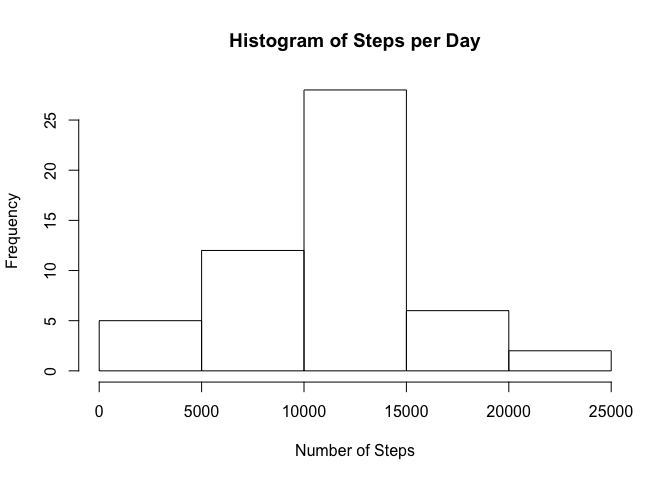
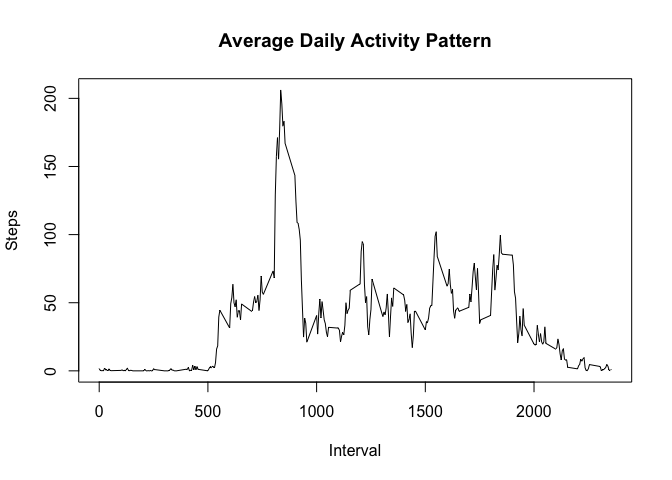
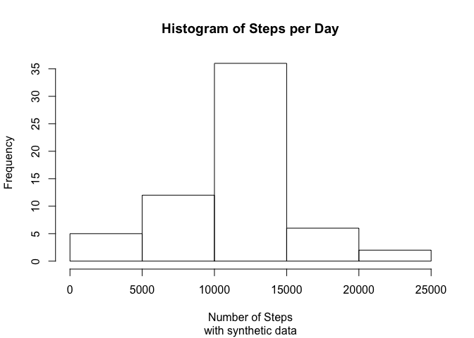
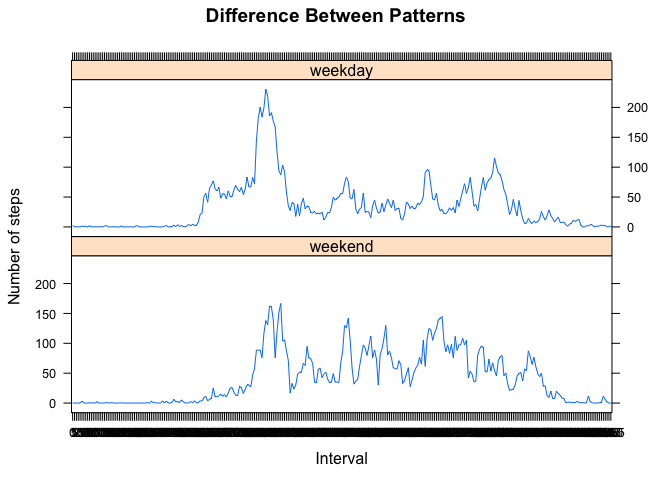

# Reproducible Research: Peer Assessment 1

## Setup ##

```r
# Disabling scientific notation
options(scipen=999)

# Plotting with lattice
library(lattice)
```
## Loading and preprocessing the data

```r
rawdata <- read.csv(unz("activity.zip", "activity.csv"), header=TRUE, na.strings="NA",colClasses=c("integer","Date","integer"),stringsAsFactors=FALSE)
rawdata$interval <- factor(rawdata$interval)
```

## What is mean total number of steps taken per day?

```r
steps_day    <- aggregate(steps ~ date, rawdata, sum)
steps_mean   <- round(mean(steps_day$steps),2)
steps_median <- median(steps_day$steps)
hist( x=steps_day$steps,main="Histogram of Steps per Day", xlab="Number of Steps" );
```

 

Mean number of steps per day: __10766.19__

Median number of steps per day: __10765__

## What is the average daily activity pattern?


```r
daily_activity <- aggregate(steps ~ interval, data=rawdata, FUN=mean)
daily_activity$interval = as.integer(levels(daily_activity$interval))[daily_activity$interval]
maxInterval <- daily_activity$interval[which.max(daily_activity$steps)]
maxSteps <-  max(daily_activity$steps)
plot(daily_activity$interval, daily_activity$step, main="Average Daily Activity Pattern", xlab="Interval", ylab="Steps",type="l") 
```

 

The 835 5-minute interval has the maximum mean of steps (206.1698113), across all the days in the dataset that contains the number of steps information.

## Imputing missing values


```r
nas_count <- sum(is.na(rawdata))
```

The number of missing records in the dataset is __2304__

Using the mean of 5-minute interval as strategy for filling in all of the missing values in the dataset.


```r
nas <- is.na(rawdata$steps)
newSteps = sapply(rawdata[nas, 3], function(x) { daily_activity[(daily_activity$interval==x), 2]})

syntheticdata <- rawdata
syntheticdata[nas,'steps'] <- newSteps
```

With this new dataset we can recreate the histogram for comparison.

```r
synthetic_steps_day    <- aggregate(steps ~ date, syntheticdata, sum)
synthetic_steps_mean   <- round(mean(synthetic_steps_day$steps),2)
synthetic_steps_median <- median(synthetic_steps_day$steps)
hist( x=synthetic_steps_day$steps,main="Histogram of Steps per Day", xlab="Number of Steps",sub="with synthetic data" );
```

 

The new mean number of steps per day: __10766.19__

The new median number of steps per day: __10766.1886792__

Given that we filled __2304__ missing values and only the median was increased by __1.1886792__ the impact can be considered very low.

## Are there differences in activity patterns between weekdays and weekends?

```r
weekdayOrWeekend <- function(date) {
    if (weekdays(as.Date(date)) %in% c("Saturday", "Sunday")) {
        "weekend"
    } else {
        "weekday"
    }
}

syntheticdata$daytype <- as.factor(sapply(syntheticdata$date, weekdayOrWeekend))
levels(syntheticdata$daytype) <- list( weekend="weekend" , weekday="weekday")

syntheticdataMean <- aggregate(syntheticdata$steps, by=list(syntheticdata$interval, syntheticdata$daytype), data=syntheticdata, FUN=mean)
colnames(syntheticdataMean) <- c('interval','daytype','steps')

xyplot(steps~interval|daytype, main="Difference Between Patterns", ylab="Number of steps", xlab="Interval", data = syntheticdataMean, type = 'l', layout = c(1,2))
```

 

